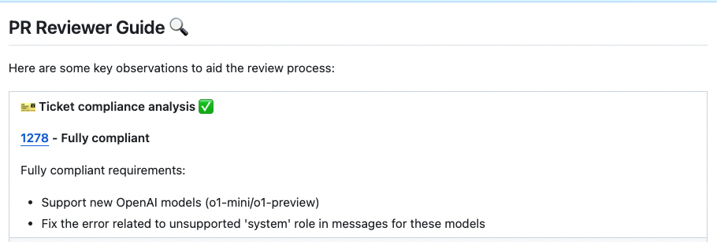

# Fetching Ticket Context for PRs

`Supported Git Platforms: GitHub, GitLab, Bitbucket, Azure DevOps`

!!! note "Branch-name linking: Jira keys on all providers; numeric GitHub issues on GitHub only"
    **Jira** ticket keys (e.g. `ABC-123`) are extracted from the branch name on **every git provider**.
    Extracting **numeric GitHub issue** links from the branch name (and the optional `branch_issue_regex` setting) is currently implemented for **GitHub only**; support for other providers is planned for a later release.

## Overview

PR-Agent streamlines code review workflows by seamlessly connecting with multiple ticket management systems.
This integration enriches the review process by automatically surfacing relevant ticket information and context alongside code changes.

**Ticket systems supported**:

- [GitHub/GitLab Issues](#githubgitlab-issues-integration)
- [Jira](#jira-integration)
- [Asana](#asana-integration)

**Ticket data fetched:**

1. Ticket Title
2. Ticket Description
3. Custom Fields (Acceptance criteria)
4. Subtasks (linked tasks)
5. Labels
6. Attached Images/Screenshots

## Affected Tools

Ticket Recognition Requirements:

- The PR description should contain a link to the ticket or if the branch name starts with the ticket id / number.
- For Jira tickets, you should follow the instructions in [Jira Integration](#jira-integration) in order to authenticate with Jira.
- For Asana tickets, see [Asana Integration](#asana-integration).

### Describe tool

PR-Agent will recognize the ticket and use the ticket content (title, description, labels) to provide additional context for the code changes.
By understanding the reasoning and intent behind modifications, the LLM can offer more insightful and relevant code analysis.

### Review tool

Similarly to the `describe` tool, the `review` tool will use the ticket content to provide additional context for the code changes.

In addition, this feature will evaluate how well a Pull Request (PR) adheres to its original purpose/intent as defined by the associated ticket or issue mentioned in the PR description.
Each ticket will be assigned a label (Compliance/Alignment level), Indicates the degree to which the PR fulfills its original purpose:

- Fully Compliant
- Partially Compliant
- Not Compliant
- PR Code Verified

{width=768}

A `PR Code Verified` label indicates the PR code meets ticket requirements, but requires additional manual testing beyond the code scope. For example - validating UI display across different environments (Mac, Windows, mobile, etc.).


#### Configuration options

-

    By default, the `review` tool will automatically validate if the PR complies with the referenced ticket.
    If you want to disable this feedback, add the following line to your configuration file:

    ```toml
    [pr_reviewer]
    require_ticket_analysis_review=false
    ```

-

    If you set:
    ```toml
    [pr_reviewer]
    check_pr_additional_content=true
    ```
    (default: `false`)

    the `review` tool will also validate that the PR code doesn't contain any additional content that is not related to the ticket. If it does, the PR will be labeled at best as `PR Code Verified`, and the `review` tool will provide a comment with the additional unrelated content found in the PR code.

## GitHub/GitLab Issues Integration

PR-Agent will automatically recognize GitHub/GitLab issues mentioned in the PR description and fetch the issue content.
Examples of valid GitHub/GitLab issue references:

- `https://github.com/<ORG_NAME>/<REPO_NAME>/issues/<ISSUE_NUMBER>` or `https://gitlab.com/<ORG_NAME>/<REPO_NAME>/-/issues/<ISSUE_NUMBER>`
- `#<ISSUE_NUMBER>`
- `<ORG_NAME>/<REPO_NAME>#<ISSUE_NUMBER>`

Branch names can also be used to link issues, for example:
- `123-fix-bug` (where `123` is the issue number)

This branch-name detection applies **only when the git provider is GitHub**. Support for other platforms is planned for later.

Since PR-Agent is integrated with GitHub, it doesn't require any additional configuration to fetch GitHub issues.

## Asana Integration

PR-Agent can detect Asana task references in PR descriptions, fetch the referenced tasks through the
[Asana API](https://developers.asana.com/reference/gettask), and include their titles, descriptions, and tags in the
ticket compliance check.

**Supported reference formats:**

- Legacy links: `https://app.asana.com/0/{project_gid}/{task_gid}`
- Current permalinks: `https://app.asana.com/1/{workspace_gid}/task/{task_gid}`
- Current project links: `https://app.asana.com/1/{workspace_gid}/project/{project_gid}/task/{task_gid}`
- Current Home links: `https://app.asana.com/1/{workspace_gid}/home/task/{task_gid}`
- Task comment links ending in `/comment/{comment_gid}` (the parent task is fetched)

**How to link a PR to an Asana task:**

Include an Asana task URL in your PR description. PR-Agent will detect it automatically and include it in the related
tickets list.

### Authentication

Create an [Asana personal access token](https://developers.asana.com/docs/personal-access-token) with access to the
tasks that PR-Agent should read. Configure it in `.secrets.toml`:

```toml
[asana]
api_token = "YOUR_PERSONAL_ACCESS_TOKEN"
```

For environment-based deployments, set the equivalent Dynaconf environment variable:

```bash
ASANA__API_TOKEN="YOUR_PERSONAL_ACCESS_TOKEN"
```

The token is sent only to Asana's fixed task API endpoint as a Bearer token. When no token is configured or a task is
not accessible to that token, PR-Agent skips that Asana task instead of evaluating compliance against placeholder
content. API request timeout can be adjusted with `asana.request_timeout` (10 seconds by default, capped at 60 seconds).

### Ticket limits

PR-Agent fetches the first three detected Asana tasks at most, preserving their description order. This is an
additive, provider-specific limit, with native tickets listed before Asana tasks:

- On GitHub, the existing limit of three GitHub issues is preserved, plus up to three Asana tasks.
- On Azure DevOps, all linked work items are preserved, plus up to three Asana tasks.
- On other providers, up to three detected Asana tasks can supply ticket context.

Keeping these limits separate prevents Asana references from silently displacing native tickets and avoids changing
the established ticket-extraction behavior of existing providers.

## Jira Integration

Only **Jira Cloud** is supported. The base URL is derived from a validated site name
(`jira_site` → `https://<site>.atlassian.net`) rather than taken as a free-form URL, so
the configured destination is always an Atlassian Cloud host. Jira Server / Data Center
(self-hosted) uses a free-form host and is not supported yet; it can be added once
base-URL handling for the self-hosted case is settled.

### Jira Cloud

#### Email/Token Authentication

You can create an API token from your Atlassian account:

1. Log in to https://id.atlassian.com/manage-profile/security/api-tokens.

2. Click Create API token.

3. From the dialog that appears, enter a name for your new token and click Create.

4. Click Copy to clipboard.

{width=384}

5. In your [configuration file](../usage-guide/configuration_options.md) add the following lines:

```toml
[jira]
jira_site = "<JIRA_SITE>"   # the "<site>" in https://<site>.atlassian.net (e.g. "mycompany")
jira_api_email = "YOUR_EMAIL"
jira_api_token = "YOUR_API_TOKEN"
```

`jira_site` is your Jira Cloud site name — the part before `.atlassian.net` (for
`https://mycompany.atlassian.net`, the site is `mycompany`). PR-Agent builds the base URL
as `https://<jira_site>.atlassian.net`; it does not accept a full URL, so configuration
cannot redirect the authenticated request to another host. Store `jira_api_email` and
`jira_api_token` as secrets (environment variables or the secrets file), not in
repository-committed configuration.

#### Acceptance criteria / requirements (optional)

To include a ticket's acceptance criteria in the analysis, set `jira_requirements_field`
to the id of the custom field that holds it. The field id is specific to your Jira
instance (for example `customfield_10127`); leave it empty to skip requirements.

```toml
[jira]
jira_requirements_field = "customfield_10127"
```

### How to link a PR to a Jira ticket

To integrate with Jira, you can link your PR to a ticket using either of these methods:

**Method 1: Description Reference:**

Include a ticket reference in your PR description, using either the complete URL format `https://<JIRA_SITE>.atlassian.net/browse/ISSUE-123` or the shortened ticket ID `ISSUE-123` (without prefix or suffix for the shortened ID).

**Method 2: Branch Name Detection:**

Name your branch with the ticket ID as a prefix (e.g., `ISSUE-123-feature-description` or `ISSUE-123/feature-description`).
