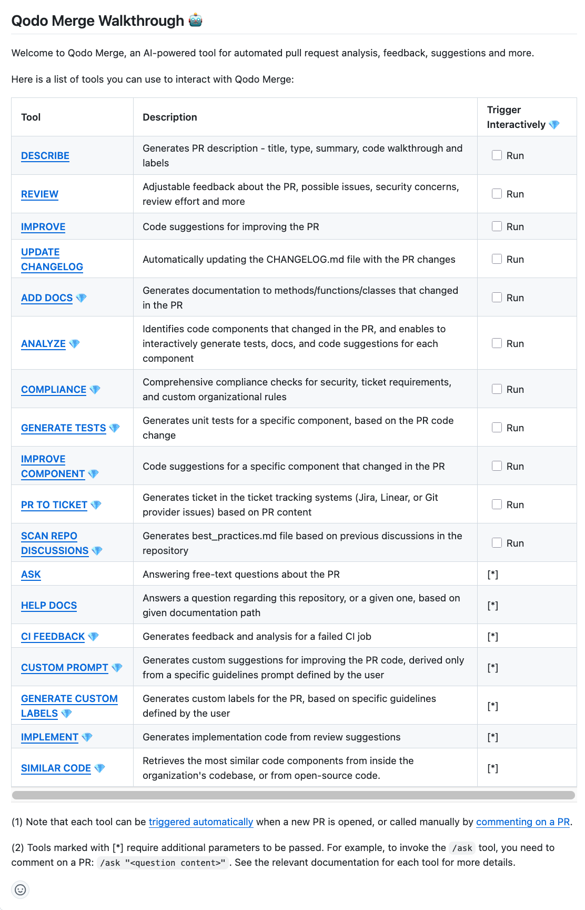

## Overview

The `help` tool provides a list of all the available tools and their descriptions.
For PR-Agent users, it also enables to trigger each tool by checking the relevant box.

It can be invoked manually by commenting on any PR:

```
/help
```

## Example usage

Invoke the `help` tool by commenting on a PR with:

{width=750}


Response will include a list of available tools:

{width=750}
