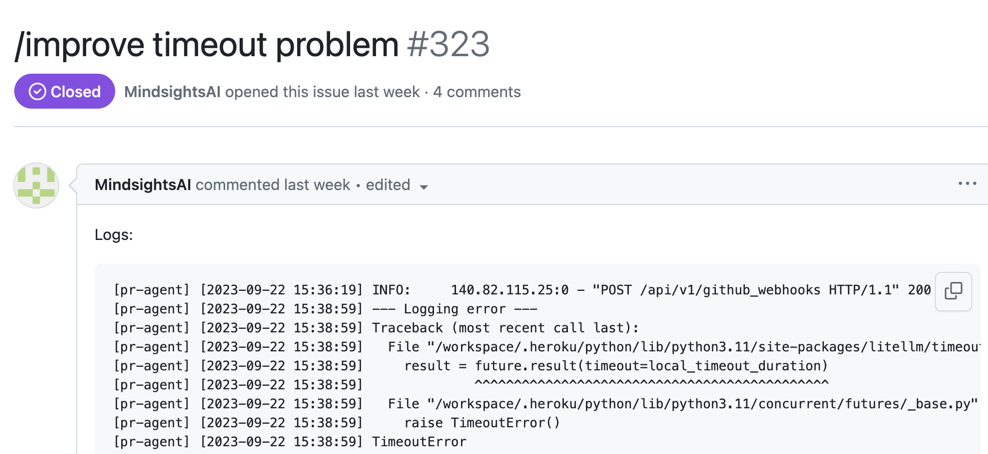
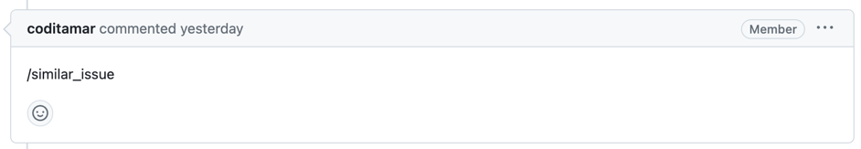
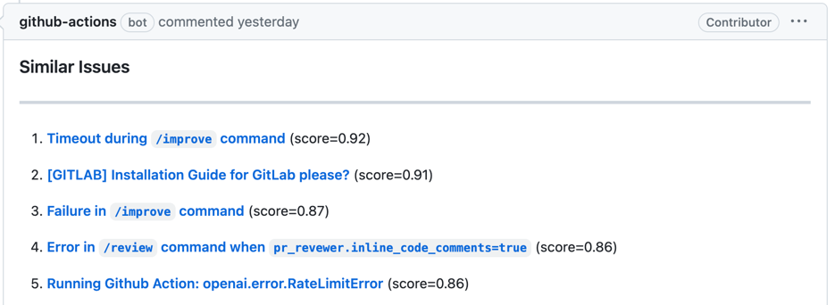

## Overview

> **Note**: `/similar_issue` is an **experimental** feature. It works only on GitHub, carries a disproportionately large share of the project's dependency and configuration surface for a single-provider tool, and is therefore excluded from the v1 stability guarantees. No backend is tested against its real driver.

The similar issue tool retrieves the most similar issues to the current issue.
It is an issue-scoped command: comment `/similar_issue` on the issue (served by the GitHub Action; the GitHub App webhook only dispatches comments on pull requests), or run it from the CLI with `--issue_url`:

```
/similar_issue
```

## Example usage

{width=768}

{width=768}

{width=768}

### Indexing and re-runs

To perform retrieval, the `similar_issue` tool indexes the repository's issues in the configured vector database. On every backend:

- The **first run** indexes up to `max_issues_to_scan` issues (default `500`).
- **Later runs** append newer issues, stopping at the first already-indexed one, so previously-indexed issues are not re-embedded.
- `force_update_dataset = true` makes every run re-index the whole repository: LanceDB deletes the repository's rows first, Pinecone and Qdrant upsert over the existing rows.
- `skip_comments = true` skips issue comments and embeds only the issue title and body.

These keys live under the `[pr_similar_issue]` section. Each backend section below describes its own configuration and re-run behaviour.

### Selecting a Vector Database

Configure your preferred database by setting the `vectordb` parameter under `[pr_similar_issue]` in `configuration.toml`:

```
[pr_similar_issue]
vectordb = "lancedb"  # options: "pinecone", "lancedb", "qdrant"
```

#### Available Options

Choose from the following Vector Databases:

1. LanceDB
2. Pinecone
3. Qdrant

#### LanceDB Configuration

LanceDB is the default backend (`vectordb = "lancedb"`) and needs no external credentials. The index is stored in a local directory given by the `[lancedb] uri` key (default `./lancedb`). A single table (`codium-ai-pr-agent-issues`) is shared by every repository indexed into the same directory; rows are tagged with the repository name in the metadata.

As described in [Indexing and re-runs](#indexing-and-re-runs), the first run creates the table and indexes up to `max_issues_to_scan` issues; later runs append newer issues until the first already-indexed one; `force_update_dataset = true` deletes the repository's rows and re-indexes them.

#### Pinecone Configuration

To use Pinecone with the `similar issue` tool, add these credentials to `.secrets.toml` (or set as environment variables):

```
[pinecone]
api_key = "..."
cloud = "aws"
region = "us-east-1"
```

The `cloud` value must be one of `aws`, `gcp` or `azure`, and `region` must be an
availability region offered by that cloud. These parameters can be obtained by
registering to [Pinecone](https://app.pinecone.io/?sessionType=signup/). Note that the
tool uses Pinecone's serverless index API; the former `environment` setting from the
gcp-starter pod tier is no longer supported.

`cloud` and `region` are only used when the index does not exist yet and needs to be
created. An existing index is opened by name and is never recreated, so moving an
existing deployment to the new configuration does not lose the stored vectors.

On re-runs, the first run creates the index and upserts up to `max_issues_to_scan` issues; later runs append newer issues until the first already-indexed one; `force_update_dataset = true` re-indexes the whole repository.

!!! note "No backend is tested against its real driver"

    The `similar-issue` dependency group is not installed in CI, so the pinecone tests run
    against a faked module, the qdrant tests never construct a client, and the lancedb tests
    run against a fake table.

!!! note "Default vector database"

    `vectordb` defaults to `lancedb`, which works with no external credentials. To use
    qdrant or pinecone, set `vectordb = "qdrant"` or `vectordb = "pinecone"` under
    `[pr_similar_issue]`.

#### Qdrant Configuration

To use Qdrant with the `similar issue` tool, add these credentials to `.secrets.toml` (or set as environment variables):

```
[qdrant]
url = "https://YOUR-QDRANT-URL" # e.g., https://xxxxxxxx-xxxxxxxx.eu-central-1-0.aws.cloud.qdrant.io
api_key = "..."
```

Then select Qdrant in `configuration.toml`:

```
[pr_similar_issue]
vectordb = "qdrant"
```

You can get a free managed Qdrant instance from [Qdrant Cloud](https://cloud.qdrant.io/).

`api_key` must be present even when the server does not enforce authentication (an empty string is accepted): the tool reads both `url` and `api_key` and raises when either is absent. A re-index uploads the whole repository in a single request.

Qdrant points are stored in a collection named `codium-ai-pr-agent-issues-v2`, derived by appending a `-v2` suffix to the shared index name (`codium-ai-pr-agent-issues`). The suffix is an implementation detail of the Qdrant backend only; pinecone and lancedb use the unsuffixed name.

On re-runs, the first run creates the collection and stores up to `max_issues_to_scan` issues; later runs append newer issues until the first already-indexed one; `force_update_dataset = true` re-indexes the whole repository.

!!! note "Upgrading an index created before the point-id fix"

    Earlier versions derived the point id from the issue id alone, so the same issue number collided
    across repositories. The id is now seeded with the repository name, which means points written by
    an earlier version are never rewritten or deleted - they still carry a matching `metadata.repo`
    payload, so they stay queryable and can surface alongside their replacements.

    The `-v2` collection suffix sidesteps this: the new index is written to
    `codium-ai-pr-agent-issues-v2`, leaving the pre-existing `codium-ai-pr-agent-issues` collection
    untouched. Nothing is deleted, and the first run after the upgrade re-indexes the repository into
    the new collection. Once you are satisfied with the results, you can delete the old
    `codium-ai-pr-agent-issues` collection from Qdrant by hand to reclaim the storage.

## How to use

- Install the tool's extra dependencies (vector databases and datasets), which a bare `uv sync` does not include:
`uv sync --group similar-issue`

- To invoke the 'similar issue' tool from **CLI**, run:
`uv run pr-agent --issue_url=... similar_issue`

- To invoke the 'similar' issue tool via online usage, [comment](https://github.com/the-pr-agent/pr-agent/issues/178#issuecomment-1716934893) on an issue:
`/similar_issue`

- You can also enable the 'similar issue' tool to run automatically when a new issue is opened, by adding it to the [pr_commands list in the github_app section](https://github.com/the-pr-agent/pr-agent/blob/main/pr_agent/settings/configuration.toml)
