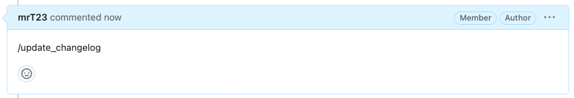
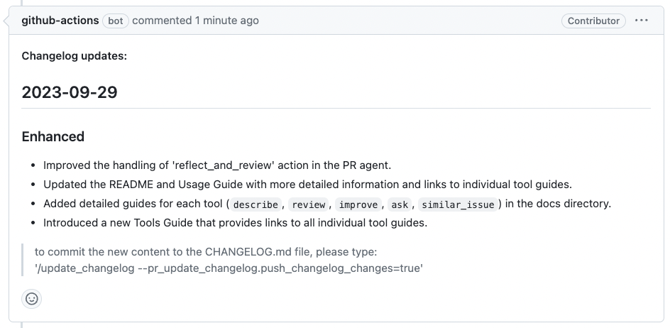

## Overview

The `update_changelog` tool automatically updates the CHANGELOG.md file with the PR changes.
It can be invoked manually by commenting on any PR:

```
/update_changelog
```

## Example usage

{width=768}

{width=768}

## Configuration options

Under the section `pr_update_changelog`, the [configuration file](https://github.com/the-pr-agent/pr-agent/blob/main/pr_agent/settings/configuration.toml) contains options to customize the 'update changelog' tool:

- `push_changelog_changes`: whether to push the changes to CHANGELOG.md, or just publish them as a comment. Default is false (publish as comment). Before pushing, the tool requires a confirmed read of the existing CHANGELOG.md; a confirmed missing file is treated as empty, while other read failures skip the repository write, attempt to publish a not-pushed fallback comment, and surface the original error. If the repository write itself fails, the tool makes one best-effort attempt to publish the generated changelog as a fallback and surfaces the original write error. Because a transport failure may happen after a completed remote write, this fallback reports the repository update as unconfirmed rather than promising it was not pushed.
- `extra_instructions`: Optional extra instructions to the tool. For example: "Use the following structure: ..."
- `add_pr_link`: whether the model should try to add a link to the PR in the changelog. Default is true.
- `skip_ci_on_push`: whether the commit message (when `push_changelog_changes` is true) will include the term "[skip ci]", preventing CI tests to be triggered on the changelog commit. Default is true.
